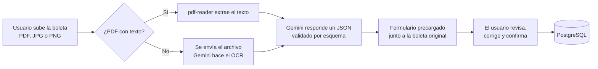
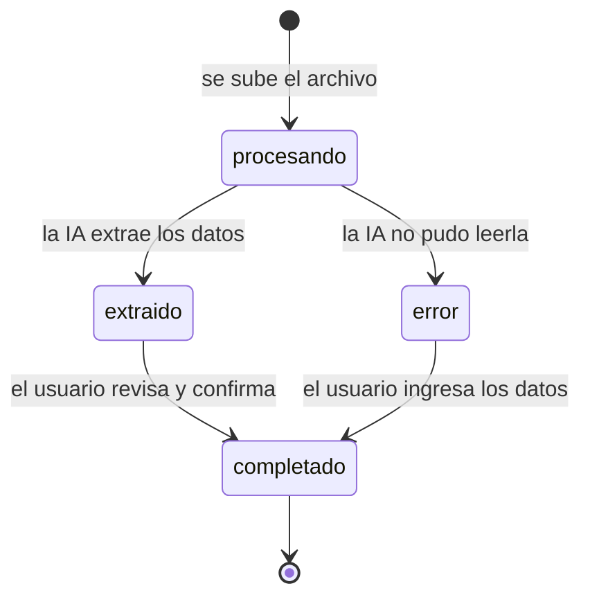

# NICO Boletas

[](https://github.com/niveKJ/nico-boletas/actions/workflows/ci.yml)


Aplicación web en Ruby on Rails para registrar boletas de compra chilenas. El usuario sube una boleta en PDF o imagen, la IA extrae los datos, el formulario se precarga y la persona revisa, corrige y guarda en PostgreSQL.

**Demo en producción:** https://nico-boletas.onrender.com

> El demo usa el plan gratuito de Render: si el servidor estuvo inactivo, la primera carga puede tardar cerca de un minuto.

## Contenido

- [Qué hace](#qué-hace)
- [Flujo de la aplicación](#flujo-de-la-aplicación)
- [Cómo se resolvió el problema](#cómo-se-resolvió-el-problema)
- [Prompt e instrucciones usadas con Gemini](#prompt-e-instrucciones-usadas-con-gemini)
- [Instalación y ejecución local](#instalación-y-ejecución-local)
- [Variables de entorno](#variables-de-entorno)
- [Pruebas y calidad](#pruebas-y-calidad)
- [Estructura del proyecto](#estructura-del-proyecto)
- [Despliegue](#despliegue)
- [Stack tecnológico](#stack-tecnológico)
- [Limitaciones conocidas](#limitaciones-conocidas)
- [Qué mejoraría con más tiempo](#qué-mejoraría-con-más-tiempo)
- [Uso de IA en el desarrollo](#uso-de-ia-en-el-desarrollo)

## Qué hace

- Recibe boletas en **PDF, JPG o PNG**, arrastrando el archivo o seleccionándolo.
- Extrae con IA el **comercio, RUT, fecha, monto total e ítems**.
- Precarga el formulario y muestra la **boleta original al lado** para comparar.
- Permite **revisar, corregir y confirmar** antes de guardar en PostgreSQL.
- Ofrece un **listado** para consultar, editar y eliminar boletas, con el total de las confirmadas.

## Flujo de la aplicación



1. El usuario sube una boleta en PDF, JPG o PNG.
2. La aplicación envía el contenido a Gemini y recibe los datos estructurados.
3. El formulario de revisión se precarga con los datos y muestra la boleta original al lado.
4. El usuario corrige lo que haga falta y confirma. Solo entonces la boleta queda como completada.
5. El listado permite consultar, editar y eliminar las boletas registradas.

Si la IA no logra leer la boleta, el registro no se pierde: queda en estado de error y el usuario puede ingresar los datos a mano.

## Cómo se resolvió el problema

### Dos caminos de extracción

Si el PDF ya trae texto (boleta electrónica), se extrae con `pdf-reader` y se envía solo el texto: es más rápido y más barato. Si es una foto o un PDF escaneado, se envía el archivo y el OCR lo hace Gemini con su modelo de visión, sin instalar un motor de OCR aparte.

### Salida estructurada

La llamada usa `responseMimeType: "application/json"` con un `responseSchema`. Gemini queda obligado a responder con los campos esperados y no hay que rescatar el JSON desde texto libre.

### Modelos alternativos

Si el modelo principal está saturado (503), sin cuota (429) o fue retirado (404), el servicio prueba con el siguiente de la lista: `gemini-3.8-flash`, `gemini-3.5-flash` y `gemini-3.1-flash-lite`.

### Normalización de los datos

El monto se guarda como entero en pesos chilenos: `"$11.332"`, `11332.0` y `"11.332,00"` terminan en `11332`. La fecha acepta `AAAA-MM-DD` y `DD/MM/AAAA`.

### La persona decide

Lo que extrae la IA nunca se da por bueno. Cada boleta pasa por estados y solo se marca como completada cuando alguien la revisa y confirma.



## Prompt e instrucciones usadas con Gemini

Toda la integración vive en [`app/services/gemini_extractor.rb`](app/services/gemini_extractor.rb).

**Prompt**

```text
Eres un extractor de datos de boletas y facturas chilenas. Lee el documento y devuelve un JSON con estos campos:
- nombre_comercio: razón social o nombre de fantasía del emisor.
- rut_comercio: RUT del emisor con formato XX.XXX.XXX-X.
- fecha: fecha de emisión en formato YYYY-MM-DD (las boletas chilenas la escriben como DD/MM/AAAA).
- monto_total: total final pagado en pesos chilenos, como número entero sin puntos ni símbolos.
- items: lista con la descripción de cada producto o servicio comprado.
Si un dato no aparece o no se puede leer, usa null. No inventes datos.
```

Cuando el PDF trae texto, el prompt va seguido de `Texto de la boleta:` y el contenido. Cuando es una imagen o un PDF escaneado, va acompañado del archivo en base64.

**Configuración de la llamada**

```json
{
  "temperature": 0,
  "maxOutputTokens": 8192,
  "responseMimeType": "application/json",
  "responseSchema": {
    "type": "OBJECT",
    "properties": {
      "nombre_comercio": { "type": "STRING", "nullable": true },
      "rut_comercio": { "type": "STRING", "nullable": true },
      "fecha": { "type": "STRING", "nullable": true },
      "monto_total": { "type": "INTEGER", "nullable": true },
      "items": { "type": "ARRAY", "items": { "type": "STRING" } }
    },
    "required": ["nombre_comercio", "rut_comercio", "fecha", "monto_total", "items"]
  }
}
```

`temperature: 0` busca que la extracción sea lo más repetible posible.

**Ejemplo de respuesta** (datos ilustrativos)

```json
{
  "nombre_comercio": "Supermercado Ejemplo",
  "rut_comercio": "76.123.456-7",
  "fecha": "2026-09-30",
  "monto_total": 11332,
  "items": ["Pan molde", "Leche entera 1L"]
}
```

## Instalación y ejecución local

**Requisitos**

- Ruby 3.4.10
- PostgreSQL en ejecución
- Una API key de Gemini, gratis en [aistudio.google.com](https://aistudio.google.com/app/apikey)

**Pasos**

```bash
# 1. Clonar el repositorio
git clone https://github.com/niveKJ/nico-boletas.git
cd nico-boletas

# 2. Instalar dependencias
bundle install

# 3. Configurar la API key
cp .env.example .env
# Editar .env y pegar tu GEMINI_API_KEY

# 4. Crear la base de datos
bin/rails db:prepare

# 5. Iniciar la aplicación (compila los estilos y levanta el servidor)
bin/dev
```

Abrir [http://localhost:3000](http://localhost:3000).

## Variables de entorno

| Variable | Obligatoria | Descripción |
|---|---|---|
| `GEMINI_API_KEY` | Sí | API key de Google Gemini. |
| `GEMINI_MODEL` | No | Modelo principal. Por defecto `gemini-3.8-flash`. |
| `DATABASE_URL` | Solo en producción | URL de conexión a PostgreSQL. |
| `RAILS_MASTER_KEY` | Solo en producción | Clave para las credenciales cifradas de Rails. |

## Pruebas y calidad

```bash
bin/rails db:test:prepare   # solo la primera vez
bundle exec rspec           # 21 pruebas
bin/rubocop                 # estilo
bin/brakeman                # análisis de seguridad
```

Las pruebas cubren el modelo (validaciones y estados), el extractor de Gemini con la API simulada (imagen, PDF con texto, modelos alternativos, errores y normalización de montos) y el guardado y la eliminación de boletas. No hacen llamadas reales a Gemini ni gastan cuota.

En cada push, GitHub Actions ejecuta RuboCop, Brakeman y la auditoría de dependencias.

## Estructura del proyecto

| Archivo | Responsabilidad |
|---|---|
| `app/services/gemini_extractor.rb` | Extracción con Gemini: prompt, esquema, modelos alternativos y normalización. |
| `app/controllers/boletas_controller.rb` | Subida, revisión, confirmación, listado y eliminación. |
| `app/models/boleta.rb` | Estados, validaciones y archivo adjunto. |
| `app/views/boletas/` | Listado, subida, revisión y detalle, con la vista previa del archivo. |
| `app/javascript/controllers/upload_controller.js` | Arrastrar y soltar, y estado de carga al subir. |
| `spec/` | Pruebas del modelo, del extractor y de las acciones de guardado y eliminación. |

## Despliegue

La aplicación está desplegada en Render con el runtime de Ruby. El script `bin/render-build.sh` instala las gemas, compila los assets y ejecuta las migraciones. En el servicio se configuran `GEMINI_API_KEY`, `DATABASE_URL` y `RAILS_MASTER_KEY`.

## Stack tecnológico

| Capa | Tecnología |
|---|---|
| Backend | Ruby on Rails 8.1 |
| Base de datos | PostgreSQL |
| Archivos adjuntos | Active Storage |
| IA y OCR | Gemini API (`gemini-3.8-flash`, con modelos alternativos) |
| Lectura de PDF con texto | `pdf-reader` |
| Cliente HTTP | `faraday` |
| Frontend | Vistas ERB y Stimulus |
| Pruebas | RSpec y FactoryBot |

## Limitaciones conocidas

- **Sin autenticación.** Cualquier persona con el enlace puede ver y subir boletas. Es aceptable para un demo, no para producción.
- **Archivos en disco local.** En el plan gratuito de Render el disco no es persistente, así que los archivos originales pueden perderse en un nuevo despliegue. Los datos extraídos sí se conservan en PostgreSQL.
- **Extracción dentro del request.** La llamada a Gemini ocurre mientras el usuario espera; una boleta suele tardar pocos segundos.

## Qué mejoraría con más tiempo

- **Procesamiento en segundo plano:** mover la llamada a Gemini a un job y avisar al usuario cuando termine, para no bloquear el request.
- **Almacenamiento persistente:** guardar los archivos en S3 o similar.
- **Validación del RUT:** comprobar el dígito verificador y avisar cuando lo leído no es un RUT válido.
- **Confianza por campo:** marcar los datos en los que la IA tuvo menos certeza, para que el usuario sepa dónde mirar primero.
- **Detección de duplicados:** avisar si ya existe una boleta con el mismo RUT, fecha y monto.
- **Autenticación:** que cada usuario vea solo sus boletas.
- **Pruebas del flujo completo:** cubrir subida, extracción y confirmación de punta a punta.
- **Exportación:** descargar el listado en CSV o Excel para uso contable.

## Uso de IA en el desarrollo

Además de la extracción con Gemini, desarrollé el proyecto con apoyo de Claude (Anthropic) como asistente de programación: para planificar la solución, escribir y revisar código, y depurar el despliegue.
